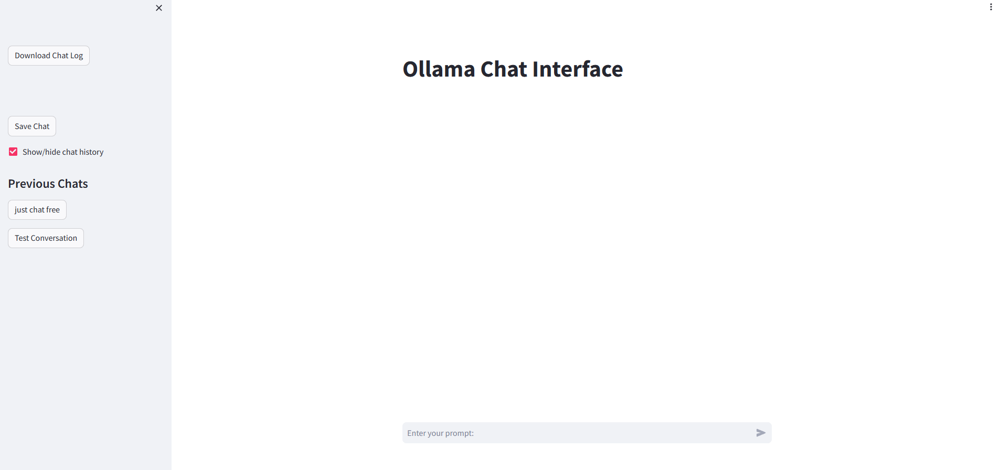

### Ollama Chat Interface with Streamlit

#### Description:
The Ollama Chat Interface is a conversational application developed using the Ollama library and Streamlit, aimed at simulating intelligent dialogues. It leverages the Ollama API to generate responses based on user inputs, allowing for interactive conversations within a streamlined interface.




There is in-chat memory so it know what you've been talking about and can hold a conversation, you can save your chats for later what is summarised and named for you and you can download the chat logs for easy access. 

Please for the love of all things **DOWNLOAD THE MODEL FIRST** the default has been changed to llama3:8b because phi3 was a bit.... terrible. 

#### Features:
- **Real-time Conversation Simulation**: Users can enter prompts, and the system generates responses dynamically, simulating a conversation.
- **Chat History Management**: Users can save and load previous chat sessions, enabling continuity and review of past interactions.
- **Chat Summarization**: Provides a summary of the chat sessions when saving, simplifying long conversations into concise summaries.
- **Download Chat Log**: Users can download the full chat history as a text file for offline review or documentation.

#### Installation:
1. **Prerequisites**:
- Python 3.10+
- Streamlit
- for intermidate.py
    - Requests library
    - [Ollama](https://ollama.com/download) 
- for simple.py
    -  ollama library

You can install the required Python libraries using the following command:

```bash
pip install -r requirements.txt
```

2. **Setup**:
   - Clone or download the source code from the repository.
   - Navigate to the directory containing `simple.py`.

3. **Running the Application** - *simple.py*:
    -  Ensure that the `model` you are trying to use as been downloaded. (the default is llama3)
   - Execute the following command in the terminal:
     ```
     streamlit run simple.py
     ```
   - Access the web interface by visiting `localhost:8501` in your web browser. or at `[yourIP]:8051` if accessing over the network

4. **Run the application** - *intermediate.py*:

    - Ensure that the local `Ollama` server is up and running on `http://localhost:11434/.
    -  Ensure that the `model` you are trying to use as been downloaded. (the default is llama3)
    - Start a terminal in the root directory of the application and run: 
    ```bash
    streamlit run intermediate.py
    ```

#### Usage:
- **Starting a Chat**: Enter your prompt in the chat input box and press enter to receive a response.
- **Saving a Chat**: Click the "Save Chat" button in the sidebar to save the current chat session.
- **Loading a Chat**: Select a previous chat from the sidebar to load and view past conversations.
- **Downloading Chat Log**: Use the "Download Chat Log" button in the sidebar to download the current chat log.

#### File Structure:
- `simple.py`: for people who want a self contained application
- `intermediate.py`: For people who want to run the Ollama Server seperately 

#### Common Issues:
- **Model Not Found Error**: Ensure the correct model name is specified and that your API keys are correctly configured.
- **Network Issues**: Check your netowrk connection if the Ollama API can't be reached, ensure you've read the F.A.Q  on [Ollama's Github](https://github.com/ollama/ollama/blob/main/docs/api.md)
- **Graphical Glitches**: When you load a chat and send your first message it will look like it unloads the chat, it is just a problem with how the messages are loaded into the chat interface. I'm sure a more motivated person could fix this. 

For more detailed documentation on the Ollama library, please refer to [Ollama's Official Documentation](https://ollama.com/library).

#### Developer Contact:
For issues, suggestions, or contributions, please contact the idiot who made this through the repository issues section
